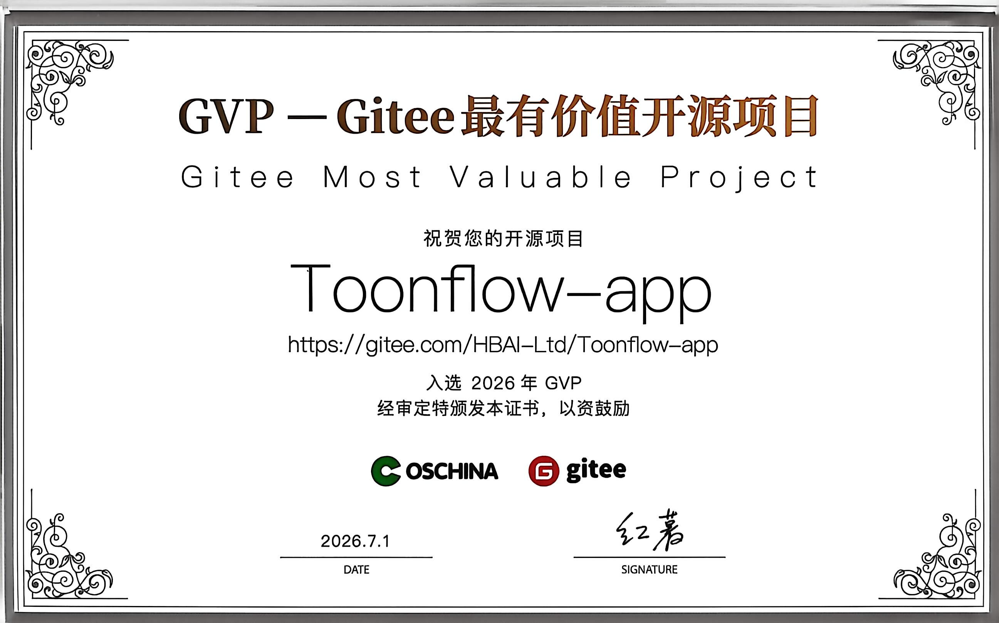

<p>
  <a href="https://github.com/HBAI-Ltd/Toonflow-app">
    
  </a>
  &nbsp;|&nbsp;
  <a href="https://gitee.com/HBAI-Ltd/Toonflow-app">
    
  </a>
  &nbsp;|&nbsp;
  <a href="https://gitcode.com/HBAI-Ltd/Toonflow-app">
    
  </a>
</p>

<p align="center">
  <a href="../README.md">简体中文</a> | 
  <a href="./README.zhtw.md">繁體中文</a> | 
  <strong>English</strong> | 
  <a href="./README.th.md">ไทย</a> | 
  <a href="./README.vi.md">Tiếng Việt</a> | 
  <a href="./README.ja.md">日本語</a> | 
  <a href="./README.ru.md">Русский</a>
</p>

<div align="center">
  <p align="center">
    
  </p>

  <p align="center">
    <a href="https://git.io/typing-svg" target="_blank">
      <picture>
        <source media="(prefers-color-scheme: dark)" srcset="https://readme-typing-svg.demolab.com?font=Fira+Code&size=40&duration=3000&pause=1000&color=FFFFFF&center=true&vCenter=true&width=600&lines=Toonflow;AI+Short+Drama+Factory;Just+a+click%2C+novels+turn+into+episodes+in+seconds!" />
        
      </picture>
    </a>
  </p>

  <p align="center">
    <a href="https://github.com/HBAI-Ltd/Toonflow-app/stargazers">
      
    </a>
    <a href="https://www.apache.org/licenses/LICENSE-2.0" target="_blank">
      
    </a>
    <a href="https://github.com/HBAI-Ltd/Toonflow-app/releases">
      
    </a>
  </p>
  <p align="center">
    <a href="https://github.com/HBAI-Ltd/Toonflow-app/network/members">
      
    </a>
    <a href="https://atomgit.com/HBAI-Ltd/Toonflow-app">
      
    </a>
    <a href="https://discord.gg/HEjKmpNpAZ">
      
    </a>
  </p>
  <p align="center">
    <a href="https://github.com/HBAI-Ltd/Toonflow-app/issues">
      
    </a>
    <a href="https://github.com/HBAI-Ltd/Toonflow-app/graphs/contributors">
      
    </a>
    <a href="https://github.com/HBAI-Ltd/Toonflow-app/commits">
      
    </a>
  </p>
  <p align="center">
    &nbsp;
    &nbsp;
    &nbsp;
    
  </p>
  
  > 🚀 **All-in-One Short Drama Workflow**: From text to characters, from storyboards to videos — zero-threshold full-process AI automation, boosting creative efficiency by 10x+!
</div>

<div align="center">
  <table>
    <tr>
      <td width="50%" align="center">
        <a href="./g-star.png" target="_blank">
          
        </a>
      </td>
      <td width="50%" align="center">
        <a href="./gvp.jpg" target="_blank">
          
        </a>
      </td>
    </tr>
  </table>
</div>

---

# 🌐 Multi-language Support

Toonflow supports the following interface languages:

| Language             | Language              |
| -------------------- | --------------------- |
| Chinese (Simplified) | 简体中文              |
| Chinese (Traditional)| 繁體中文              |
| English              | English               |
| Thai                 | ไทย                  |
| Vietnamese           | Tiếng Việt            |
| Japanese             | 日本語                |
| Russian              | Русский               |

> 💡 More languages are being adapted — contributions for translations are welcome!

---

# 🌟 Key Features

Toonflow is an AI workstation designed for short drama production, building a complete closed loop around "Planning → Scriptwriting → Storyboarding → Final Output," supporting a localized, programmable, and continuously iterable production workflow.

- ✅ **Infinite Canvas Production Workbench**  
  Organize scripts, characters, storyboards, assets, and video nodes in an infinite canvas-like layout, supporting free arrangement, backtracking, and parallel production without linear constraints.
- ✅ **Three-layer Agent Collaboration System**  
  Decision, execution, and supervision layers work together, covering task decomposition, content generation, quality review, and revision feedback, improving stability and output consistency.
- ✅ **Persistent Agent Memory**  
  Cross-session memory system based on local ONNX vector retrieval, supporting short-term messages, long-term summaries, and semantic recall, ensuring multi-round creative continuity.
- ✅ **Programmable Provider System**  
  Write vendor TypeScript logic directly in the settings center, taking effect instantly without modifying source code or restarting, making it easy to privatize and integrate multiple models.
- ✅ **Chapter Event Graph-driven Adaptation**  
  Automatically extract chapter events from original novels and store them structurally. Script adaptation uses event graphs to precisely invoke context, reducing information loss in long texts.
- ✅ **Skill File Configuration**  
  Core prompts for ScriptAgent and ProductionAgent are externalized as Markdown Skill files, supporting online editing and rapid tuning.

---

# 📦 Application Scenarios

- Short video content creation
- Novel-to-film experimentation
- AI literary adaptation tool
- Script development and rapid prototyping
- Video asset generation

---

# 🔰 User Guide

## Quick Start

1. Launch the application and log in (default: `admin` / `admin123`).
2. Complete model vendor configuration in the settings center (text/image/video models).
3. Create a new project and import the original novel, then execute chapter event extraction.
4. Enter ScriptAgent to generate the story skeleton, adaptation strategy, and structured script.
5. Switch to ProductionAgent to organize storyboards, assets, and video nodes on the infinite canvas.
6. Perform node-based refinement on storyboard images, then return them to the workbench for video stitching and export.

## 📺 Video Tutorial

https://www.bilibili.com/video/BV1oXD7BqEqJ
[](https://www.bilibili.com/video/BV1oXD7BqEqJ)

**Toonflow 12-minute Quick Start AI Video**
👉 [Click to Watch](https://www.bilibili.com/video/BV1oXD7BqEqJ)

📱 Scan with WeChat to watch


---

# 📸 Demo Screenshots & Video

The following screenshots and video are from a short AI drama demo made with Toonflow, completed in about 2 hours, covering script generation, storyboard creation, and editing.

<div align="center">
<table>
  <tr>
    <td width="50%"><a href="./screenshot/1.png" target="_blank"></a></td>
    <td width="50%"><a href="./screenshot/2.png" target="_blank"></a></td>
  </tr>
  <tr>
    <td width="50%"><a href="./screenshot/3.png" target="_blank"></a></td>
    <td width="50%"><a href="./screenshot/4.png" target="_blank"></a></td>
  </tr>
  <tr>
    <td width="50%"><a href="./screenshot/5.png" target="_blank"></a></td>
    <td width="50%"><a href="./screenshot/6.png" target="_blank"></a></td>
  </tr>
  <tr>
    <td width="50%"><a href="./screenshot/7.png" target="_blank"></a></td>
    <td width="50%"><a href="./screenshot/8.png" target="_blank"></a></td>
  </tr>
  <tr>
    <td width="50%"><a href="./screenshot/9.png" target="_blank"></a></td>
    <td width="50%"><a href="./screenshot/10.png" target="_blank"></a></td>
  </tr>
</table>
</div>

## 🎬 Demo Video

<div align="center">

https://github.com/user-attachments/assets/2d9fddac-dfdf-4640-b030-b09d7f7287e9

If the video cannot play, please [click to download](./screenshot/demo.mp4)

</div>

## Demo Info

| Item              | Details                                  |
| :---------------- | :--------------------------------------- |
| Production Cycle  | Approximately 2 hours                    |
| Video Model       | Seedance 2.0                             |
| Image Model       | GPT Image 2                              |
| Language Model    | Claude Opus 4.6                          |
| Total Duration    | Approximately 2 minutes (raw 3 min, cut ~1 min of unusable footage) |

## Cost Breakdown

| Model Type     | Cost         |
| :------------- | :----------- |
| Language Model | ~￥10        |
| Video Model (full generation) | ~￥120 |
| Image Model    | Less than ￥1|
| **Total**      | **~￥130**   |

> **Disclaimer**: The demo's original resolution is 1080×1882; the release version has been compressed to 480p. If there are any copyright issues, please contact us to delete it.

---

# 🚀 Installation

## Prerequisites

Before installing and using this software, please prepare the following:

- ✅ Large language model AI service API endpoint
- ✅ Sora or Doubao video service API endpoint
- ✅ Nano Banana Pro image generation model service API

## Local Installation

### 1. Download & Install

| OS      | GitHub                                                       | Notes                         |
| :-----: | :----------------------------------------------------------- | :---------------------------- |
| Windows | [Release](https://github.com/HBAI-Ltd/Toonflow-app/releases) | Official release package      |
| Linux   | [Release](https://github.com/HBAI-Ltd/Toonflow-app/releases) | Official release package      |
| macOS   | [Release](https://github.com/HBAI-Ltd/Toonflow-app/releases) | Official release package      |

> [!CAUTION]
> On macOS, go to Settings > Privacy & Security to configure security settings; otherwise, the app may not open due to certificate issues.
>
> Reference: [https://www.zhihu.com/question/433389276](https://www.zhihu.com/question/433389276)

> Due to Gitee OS environment limitations and Release file upload size restrictions, we currently do not provide a Gitee Release download link.

### 2. Start the Service

After installation, launch the program to start using the service.

> ⚠️ **First Login**  
> Username: `admin`  
> Password: `admin123`

## Docker Deployment

### Prerequisites

- [Docker](https://docs.docker.com/get-docker/) installed (version 20.10+)

### Method 1: Online Deployment

To be completed; use local build for now.

### Method 2: Local Build

Build directly from existing local source code, suitable for developers or users who have already cloned the repository. Requires git installed locally:

```shell
# Clone the project first (skip if already cloned)
git clone https://github.com/HBAI-Ltd/Toonflow-app.git
cd Toonflow-app

# Build and start locally using docker-compose
yarn docker:local

# Or build manually
docker build -t toonflow .
docker run -d -p <local_port>:10588 -v <local_data_path>:/app/data toonflow

# Access the page at the corresponding port path /index.html
# Example: http://localhost:10588/index.html
```

### Service Port Description

| Port   | Purpose          | Deployment Mapping |
| ------ | ---------------- | ------------------ |
| `10588`| Software UI      | `10588:10588`      |

**Environment Variables:**

| Variable  | Description                                |
| --------- | ------------------------------------------ |
| `NODE_ENV`| Running environment; `prod` for production |
| `PORT`    | Service listening port (default 10588)     |
| `OSSURL`  | File storage access URL for static assets  |

---

## Cloud Deployment

### Cloud Server Deployment

#### I. Server Environment Requirements

- **OS**: Ubuntu 20.04+ / CentOS 7+
- **Node.js**: 24.x (recommended, minimum 23.11.1+)
- **Memory**: 2GB+

#### II. Server Deployment

##### 1. Install Environment

```bash
# Install Node.js
curl -o- https://raw.githubusercontent.com/nvm-sh/nvm/v0.39.7/install.sh | bash
source ~/.bashrc
nvm install 24
# Install Yarn and PM2
npm install -g yarn pm2
```

##### 2. Deploy the Project

**Clone from GitHub:**

```bash
cd /opt
git clone https://github.com/HBAI-Ltd/Toonflow-app.git
cd Toonflow-app
yarn install
yarn build
```

**Clone from Gitee (recommended for China):**

```bash
cd /opt
git clone https://gitee.com/HBAI-Ltd/Toonflow-app.git
cd Toonflow-app
yarn install
yarn build
```

##### 3. Configure PM2

Create `pm2.json` file:

```json
{
  "name": "toonflow-app",
  "script": "data/serve/app.js",
  "instances": "max",
  "exec_mode": "cluster",
  "env": {
    "NODE_ENV": "prod",
    "PORT": 10588,
    "OSSURL": "http://127.0.0.1:10588/"
  }
}
```

**Environment Variable Description:**

| Variable  | Description                                |
| --------- | ------------------------------------------ |
| `NODE_ENV`| Running environment; `prod` for production |
| `PORT`    | Service listening port                     |
| `OSSURL`  | File storage access URL for static assets  |

---

##### 4. Start the Service

```bash
pm2 start pm2.json
pm2 startup
pm2 save
```

##### 5. Common Commands

```bash
pm2 list              # View processes
pm2 logs toonflow-app # View logs
pm2 restart all       # Restart services
pm2 monit             # Monitoring dashboard
```

> ⚠️ **First Login**  
> Username: `admin`  
> Password: `admin123`

##### 6. Deploy the Frontend

If you need to deploy or customize the frontend separately, please refer to the frontend repository:

- **GitHub**: [Toonflow-web](https://github.com/HBAI-Ltd/Toonflow-web)
- **Gitee**: [Toonflow-web](https://gitee.com/HBAI-Ltd/Toonflow-web)

> 💡 **Note**: This repository already includes pre-built frontend resources; regular users do not need to deploy the frontend separately. The frontend repository is for developers who need secondary development.

### Cloud Platform Deployment

> 🎉 **Newly Certified Official Compute Partner Platform — AI Galaxy**
>
> **[AI Galaxy](https://www.ai-galaxy.com/)** is a **Toonflow officially authorized commercial image provider**, offering a fully compliant, pre-built Toonflow AI short-drama production image for commercial use — **ready to use out of the box, no manual deployment required**.
>
> - 🌐 Website: [https://www.ai-galaxy.com](https://www.ai-galaxy.com)
> - 📖 Official image deployment tutorial: [Click to view](https://mp.weixin.qq.com/s/lq9X1ovQ1_TKeXMOLgicKg?scene=1)

<details>
<summary>📄 Click to expand the text tutorial</summary>

#### I. GPU Rental Stage

1. On AI Galaxy - Compute Marketplace - RTX 4090 / 4090 Plus, click "Rent Now" to open the rental details page.
   > 💡 It's recommended to enable "hourly auto-renewal" to prevent the instance from expiring while a video render is still in progress.
2. Select the image: `windows10LTSCwin10_Toonflow` - Create Instance.
3. Wait 30–60 seconds for the instance to start, then check the connection method — download the RDP login file, copy the password, and double-click the downloaded remote desktop file.
4. Paste the copied password and log in to enter the cloud desktop.
   > 💡 Move the mouse to the top of the cloud desktop and pause briefly to reveal the desktop-switching toolbar. Click "──" to switch back to your local desktop, or "□" to shrink it into a window on your local desktop.

#### II. Configure Toonflow & Start ComfyUI Stage

1. First configure the model used by the Agent: open Toonflow on the desktop - Model Services - OpenAI-compatible interface - enter the API key and request URL.
   Default account: `admin`  Password: `admin123` (recommended to change the password after logging in)
   > 💡 This uses AI Galaxy's AI model Token service directly — an official interface that's stable, secure, and up to 40% off (converting a novel into a script cost about ¥0.64).
   - AI Galaxy model Token request URL: `https://token.ai-galaxy.com/v1`
   - AI Galaxy Token top-up steps: Token Marketplace - Account Overview - Top Up - transfer your AI Galaxy balance or compute vouchers into your Token account.
   - After topping up, go to "Key Management" - New API, name it `Toonflow` or anything you like, confirm, and copy the API key.
2. Back in step 1, paste the generated API key and request URL into Toonflow's Model Services, then click elsewhere; the system will show "Provider configuration updated".
   Click "Add Manually", go back to the AI Galaxy Token Marketplace page, and copy the full model name.
   > 💡 One key can call every model on AI Galaxy — just pick the one you want to use; `deepseek-v4-pro` is recommended.
   Paste the full model name into Toonflow and confirm to complete the model configuration.
3. After configuration, check two things:
   - Whether all three model toggles in Model Services are enabled
   - Whether the model configured in the Agent settings matches your configuration (click to correct it if not)
4. Start ComfyUI: Cloud Desktop - ComfyUI Launcher - One-Click Start.
5. Startup takes about 1–2 minutes; keep the page open once it's running.

</details>

---

# 🔧 Development Guide

> [!CAUTION]
> 🚧 **PR Submission Guidelines** 🚧
>
> ⛔ Do not submit PRs to the `master` branch. ✅ Please submit PRs to the `develop` branch.
>
> Developers are welcome to contribute to Toonflow. If interested, please contact the maintainer ACT in the community group.

## 🛠️ Tech Stack

| Category      | Technology                                                                                    |
| ------------- | --------------------------------------------------------------------------------------------- |
| Runtime       | Node.js 23.11.1+                                                                              |
| Language      | TypeScript 5.x                                                                                |
| Backend       | Express 5                                                                                     |
| Database      | SQLite (better-sqlite3 / knex)                                                                |
| AI Integration| Vercel AI SDK (OpenAI / Anthropic / Google / DeepSeek / Zhipu / MiniMax / Tongyi Qianwen / xAI)|
| Local Inference| @huggingface/transformers (ONNX)                                                              |
| Real-time     | Socket.IO                                                                                     |
| Desktop       | Electron 40                                                                                   |
| Image Processing| Sharp                                                                                       |
| Containerization| Docker                                                                                     |

## Development Environment Setup

- **Node.js**: Version 23.11.1 or higher
- **Yarn**: Recommended as package manager

## Quick Start Project

1. **Clone the Project**

   **Clone from GitHub:**

   ```bash
   git clone https://github.com/HBAI-Ltd/Toonflow-app.git
   cd Toonflow-app
   ```

   **Clone from Gitee (recommended for China):**

   ```bash
   git clone https://gitee.com/HBAI-Ltd/Toonflow-app.git
   cd Toonflow-app
   ```

2. **Install Dependencies**

   Run the following command in the project root to install dependencies:

   ```bash
   yarn install
   ```

3. **Start Development Environment**

   This project includes both the **backend API service** and **frontend pages**. Choose the appropriate startup method:

   - **Method 1: Start backend only**

     ```bash
     yarn dev
     ```

     > ⚠️ This command starts only the backend API service (port 10588), **without the frontend**. Accessing `http://localhost:10588` will only call API endpoints, not display the full UI. To use the frontend, either run the frontend project separately or use the GUI mode below.

   - **Method 2: Start Electron Desktop Client**

     ```bash
     yarn dev:gui
     ```

     > This command starts both the backend service and the Electron desktop window with a built-in frontend page, ready to use out of the box. Ideal for developers who want the full experience.

   - **Method 3: Production Mode**

     ```bash
     yarn start
     ```

     > Runs the compiled service in production mode (requires `yarn build` first).

4. **Package the Project**

   - Compile and generate TypeScript files:

     ```bash
     yarn build
     ```

   - Package as Windows executable:

     ```bash
     yarn dist:win
     ```

   - Package as macOS executable:

     ```bash
     yarn dist:mac
     ```

   - Package as Linux executable:

     ```bash
     yarn dist:linux
     ```

5. **Code Quality Check**

   - Run global syntax and lint checks:

     ```bash
     yarn lint
     ```

6. **AI Debug Panel (Optional)**

   Launch a visual debugging tool for the AI SDK to facilitate debugging AI calls:

   ```bash
   yarn debug:ai
   ```

## Frontend Development

To modify the frontend, please use the frontend repository:

- **GitHub**: [Toonflow-web](https://github.com/HBAI-Ltd/Toonflow-web)
- **Gitee**: [Toonflow-web](https://gitee.com/HBAI-Ltd/Toonflow-web)

After building the frontend, copy the `dist` directory contents into the `data/web` directory of this project to integrate.

## Project Structure

```
📂 build/                    # Build artifacts
📂 data/                     # Runtime data
│  ├─ 📂 models/            # Local inference models (ONNX)
│  ├─ 📂 oss/               # Object storage (assets/characters/scenes)
│  ├─ 📂 serve/             # Production entry point
│  ├─ 📂 skills/            # Agent skill prompts
│  └─ 📂 web/               # Frontend build artifacts (built-in)
📂 docs/                     # Documentation resources
📂 env/                      # Environment configuration
📂 scripts/                  # Build and helper scripts
📂 src/
├─ 📂 agents/               # AI Agent modules
│  ├─ 📂 productionAgent/   # Production Agent
│  └─ 📂 scriptAgent/       # Script Agent
├─ 📂 lib/                  # Common libraries (DB init, response formats)
├─ 📂 middleware/            # Middleware
├─ 📂 routes/               # Route modules
│  ├─ 📂 agents/            # Agent memory management
│  ├─ 📂 artStyle/          # Art style management
│  ├─ 📂 assets/            # Asset management
│  ├─ 📂 assetsGenerate/    # Asset generation
│  ├─ 📂 cornerScape/       # Storyboard management
│  ├─ 📂 general/           # General interfaces
│  ├─ 📂 login/             # Login authentication
│  ├─ 📂 migrate/           # Data migration
│  ├─ 📂 modelSelect/       # Model selection
│  ├─ 📂 novel/             # Novel management
│  ├─ 📂 other/             # Other features
│  ├─ 📂 production/        # Production management
│  ├─ 📂 project/           # Project management
│  ├─ 📂 script/            # Script generation
│  ├─ 📂 scriptAgent/       # Script Agent API
│  ├─ 📂 setting/           # System settings
│  ├─ 📂 task/              # Task management
│  └─ 📂 test/              # Test interfaces
├─ 📂 socket/               # WebSocket real-time communication
├─ 📂 types/                # TypeScript type declarations
├─ 📂 utils/                # Utility functions
├─ 📄 app.ts                # Application entry
├─ 📄 core.ts               # Core initialization
├─ 📄 env.ts                # Environment variable handling
├─ 📄 err.ts                # Error handling
├─ 📄 logger.ts             # Logging module
├─ 📄 router.ts             # Route registration
└─ 📄 utils.ts              # Common utilities
📄 Dockerfile                # Docker build file
📄 electron-builder.yml      # Electron packaging config
📄 skillList.json            # Skill list
📄 LICENSE                   # License (Apache-2.0)
📄 NOTICES.txt               # Third-party dependency notices
📄 package.json              # Project configuration
📄 tsconfig.json             # TypeScript configuration
```

---

# 🔗 Related Repositories

| Repository       | Description                              | GitHub                                             | Gitee                                            |
| ---------------- | ---------------------------------------- | -------------------------------------------------- | ------------------------------------------------ |
| **Toonflow-app** | Full client (this repo, recommended for regular users) | [GitHub](https://github.com/HBAI-Ltd/Toonflow-app) | [Gitee](https://gitee.com/HBAI-Ltd/Toonflow-app) |
| **Toonflow-web** | Frontend source code (for frontend developers) | [GitHub](https://github.com/HBAI-Ltd/Toonflow-web) | [Gitee](https://gitee.com/HBAI-Ltd/Toonflow-web) |

> 💡 **Tip**: If you simply want to use Toonflow, download the client from this repository. The frontend repository is for developers who need secondary development or UI customization.

---

# 👨‍👩‍👧‍👦 WeChat Group

Helper bot:


You can also click the icon to join Discord:

[](https://discord.gg/HEjKmpNpAZ)

Or click the invite link: [https://discord.gg/HEjKmpNpAZ](https://discord.gg/HEjKmpNpAZ)

---

# 💌 Contact Us

📧 Email: [ltlctools@outlook.com](mailto:ltlctools@outlook.com?subject=Toonflow Inquiry)

---

# 📜 License

Toonflow is open-sourced under the Apache-2.0 license, with supplementary commercial terms.

License details: https://www.apache.org/licenses/LICENSE-2.0

## Supplementary Agreement

- If you distribute this software as a product to **2 or more independent third parties**, you must obtain **written commercial authorization** from HBAI-Ltd.
- **≤ 5 legal entities** jointly operating for internal use without providing services externally is considered internal use and **does not require authorization**.
- Do not remove or modify any Toonflow identifiers or copyright information.

## Permanent Free Use Cases

- ✅ Creating content with Toonflow and receiving platform revenue shares
- ✅ Secondary development for internal team use
- ✅ ≤ 5 legal entities joint internal operation
- ✅ Personal learning, research, non-commercial use

## Commercial License Pricing

| Stage         | Annual Revenue | Annual Fee                    |
| ------------- | -------------- | ----------------------------- |
| 🌱 Support    | < ¥100,000     | **Free license upon request** |
| 🚀 Startup    | ¥100–500,000   | ¥5,000/year                   |
| 📈 Growth     | ¥500k–1.5M     | ¥20,000/year                  |
| 🏢 Scale      | ¥1.5M–5M       | ¥80,000/year                  |
| 🌐 Enterprise | > ¥5M          | Negotiable                    |

> **Non-retroactive clause**: Users who used Toonflow under AGPL-3.0 before the v1.0.8 release will continue to be governed by AGPL-3.0 and are not affected by this agreement change.

See the full agreement in the [LICENSE](./LICENSE) file.

---

# ⭐️ Star History

[](https://www.star-history.com/#HBAI-Ltd/Toonflow-app)

[](https://www.star-history.com/#HBAI-Ltd/Toonflow-app&type=timeline&legend=top-left)

---


# 🙏 Acknowledgements

We thank the following open-source projects for providing powerful support to Toonflow:

- [Express](https://expressjs.com/) - Fast, unopinionated, minimalist web framework for Node.js
- [AI SDK](https://ai-sdk.dev/) - AI toolkit for TypeScript
- [Better-SQLite3](https://github.com/WiseLibs/better-sqlite3) - High-performance SQLite3 binding
- [Sharp](https://sharp.pixelplumbing.com/) - High-performance Node.js image processing
- [Axios](https://axios-http.com/) - Promise-based HTTP client
- [Zod](https://zod.dev/) - TypeScript-first schema validation
- [Socket.IO](https://socket.io/) - Real-time bidirectional event-based communication
- [Electron](https://www.electronjs.org/) - Cross-platform desktop application framework
- [Hugging Face Transformers](https://huggingface.co/docs/transformers.js) - Local ML inference library

We also thank the following organizations/units/individuals for their support:

<table>
  <thead>
    <tr>
      <th align="center">Logo</th>
      <th align="center">Name</th>
      <th align="center">Support Type</th>
      <th>Introduction</th>
      <th align="center">Website</th>
    </tr>
  </thead>
  <tbody>
    <tr>
      <td align="center"></td>
      <td align="center"><b>Sophnet</b></td>
      <td align="center">💻 Computing Sponsorship</td>
      <td>Committed to building a faster, more stable, and more cost-effective one-stop model inference API service platform</td>
      <td align="center"><a href="https://www.sophnet.com/">Website</a></td>
    </tr>
    <tr>
      <td align="center"></td>
      <td align="center"><b>Atlas Cloud</b></td>
      <td align="center">💻 Computing Sponsorship</td>
      <td>The world's first full-modality reasoning platform. Dialogue, image, video, audio — all unified API. 300+ models, OpenAI compatible.</td>
      <td align="center"><a href="https://www.atlascloud.ai/">Website</a></td>
    </tr>
    <tr>
      <td align="center"></td>
      <td align="center"><b>Tencent Hunyuan 3D</b></td>
      <td align="center">🌐 World Model Technical Support</td>
      <td>Tencent Hunyuan 3D AI creation engine based on version 2.5 of the Hunyuan 3D generation large model, the industry's first one-stop 3D content AI creation platform. Features text-to-3D, image-to-3D, 3D animation generation, texture generation, supports sketch-to-3D, 3D character generation, with advantages in low-poly model generation.</td>
      <td align="center"><a href="https://3d.hunyuan.tencent.com/">Website</a></td>
    </tr>
    <tr>
      <td align="center"></td>
      <td align="center"><b>AI Galaxy</b></td>
      <td align="center">💻 Compute Support <br/> 🖼️ Image Support</td>
      <td>A well-known professional compute service brand in China, providing affordable and stable compute power. Serves labs at over a thousand top universities (Tsinghua, Peking, Fudan, Zhejiang University, etc.), the Chinese Academy of Sciences, and 5,000+ AI companies.</td>
      <td align="center"><a href="https://www.ai-galaxy.com">Website</a></td>
    </tr>
  </tbody>
</table>

For the complete list of third-party dependencies, please refer to `NOTICES.txt`

##### copyright © Beijing Ai'a Technology Co., Ltd.


